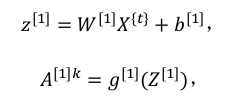

## mini-batch 梯度下降法

在巨大的数据集基础上进行训练神经网络模型的速度很慢，通过mini-batch梯度下降法能让你的神经网络运行得更快。

### （1）mini-batch 步骤

对m个训练样本进行向量化后，得到矩阵X：

以及矩阵Y：

这样可以提高训练速度，但是但m十分大（上千万或者过亿），处理速度仍然缓慢，所以在执行梯度下降法之前，必须先对训练集进行处理。

​       第一步：把训练集分割为小一点的子集训练，这些子集被取名为 mini-batch；我们可以把第1个样本到第1000个样本取出，组成一个mini-batch矩阵,第1001-2001个样本组成第二个mini-batch，以此类推。如下图：

对Y也进行同样的操作：

第二步：执行mini-batch算法，每次处理的单个的 mini-batch，而不是同时处理全部的X和Y训练集。第t个 mini-batch的处理过程如下：

以此类推,直到最后一层的输出：

接着计算成本损失函数(因为这第t个 mini-batch 的损失,所以将 J 损失记为上角标 t )：

根据成本损失函数，执行反向传播来计算第 t 个样本的 J 的梯度，更新矩阵 W 和 b。

​        以上是使用一个mini-batch 梯度下降法训练样本的一步，也可被称为进行“一代”(1 epoch)的训练。

​         使用 batch 梯度下降法,一次遍历一个mini-batch训练集只能让梯度下降一次, 有多少个mini-batch训练集就可执行多少次epoch，使梯度不断下降。可以通过循环来实现遍历所有的mini-batch，直到最后收敛到一个合适的精度。

### （2）mini- batch 的大小

下图是使用mini-batch 和未使用mini-batch的成本损失函数的梯度下降图：

​        用 batch 梯度下降法时,每次迭代你都需要历遍整个训练集,每次迭代成本都会下降,如果 J 在某次迭代中增加了,也许你的学习率太大。

​        使用 mini-batch 梯度下降法，成本损失函数 J 走向朝下,但有很多的噪声，噪声产生的原因在于也许某个 mini-batch易于计算,因此成本会低一些。不过也存在比较难运算的 mini-batch,成本会更高一些,所以才会出现这些摆动。

假设训练集的大小为m，有以下三种情况：

- 当mini-batch = 1，称为随机梯度下降法，每个样本都是独立的 mini-batch，随机梯度下降法是有很多噪声的,它最终会靠近最小值,但永远不会收敛,一直在最小值附近波动。
- 当mini-batch = m，称为batch 梯度下降法，每个迭代需要处理大量训练样本,当训练样本数量巨大的时候,单次迭代耗时太长。batch 梯度下降法从某处开始,相对噪声低些,幅度也大一些,可以找到最小值。
- mini-batch 大小介于1 ～ m 之间，一般的 mini-batch 大小为 64 到 512（2 的n次方）,它不会总朝向最小值靠近,但比随机梯度下降要更持续地靠近最小值的方向,如果出现在很小的范围内收敛或者波动,可以慢慢减少学习率

​       最后需要注意的是在你的 mini-batch 中,要确保mini-batch的大小要符合 CPU/GPU 内存,取决于你的应用方向以及训练集的大小。

​        在深度学习领域，mini-batch 大小是一个重要的变量,可以尝试几个不同的值,几个不同的 2 次方,然后看能否找到一个让梯度下降优化算法最高效的大小。

