​         Softmax 回归是logistic回归是用的一般形式，它将logistic 激活函数推广到C类(C是神经网络模型的输出),而不仅仅是两类,是一种多分类器,如果C = 2,那么Softmax实际上变回了 logistic 回归,。

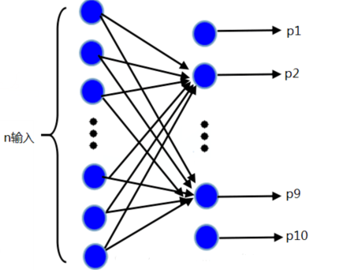

如图所示，假设神经网络模型共有n个输入，l 层，输出结果有m个(本例中m=10)。前 l - 1层的计算与神经网络模型的计算一样，用如下公式：

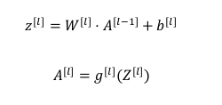

区别在于最后一层的激活函数不在是 g(x) ，而是使用softmax激活函数，具体步骤如下:

1. 由最后一层的输入A[l-1]计算出Z[l]，计算一个临时变量t：

   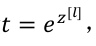

   

2. 计算输出a:

   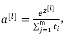

   最后计算结果是由概率组成的维数为(m, 1)的向量，如上图的p1，p2……p10，px的大小表示该输入是类别x的可能性的大小。

   下面是个具体例子，假设z[l] 数值如下：

   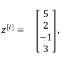

   可以算出t :

   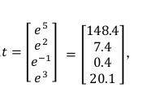

   把t的元素都加起来，得到 176.3，所以：

   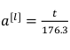

   最终有：

   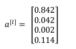

   由a[l]，概率P1 = 0.842最大，可知该分类结果为类别1。

   

   用什么损失函数来训练softmax多分类器的神经网络?

   在 Softmax 分类中,我们一般用到的单个样本的损失函数是：

   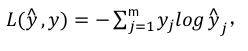

   整个训练集损失的总和：

   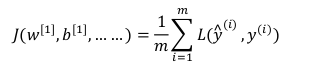

   我们要做的就是用梯度下降法,使这里的损失最小化。

   

   

   

   

   

   

   

   

   

   

   

   

   

   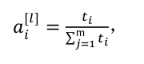

   

   

   

   

   

   

   

   

   

