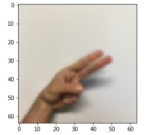
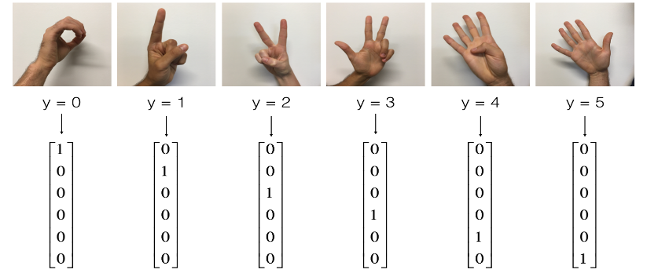
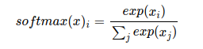
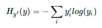
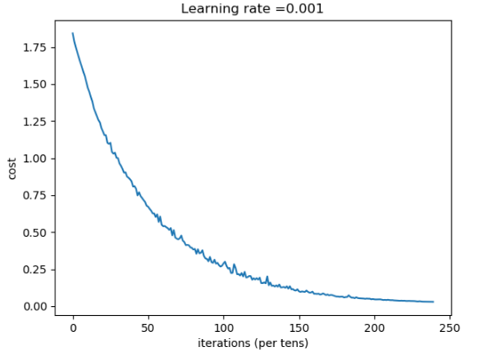

## tensorflow基础

编写和运行tensorflow主要有以下几个步骤：

（1）创建一个变量(或张量)

（2）定义张量之间的操作

（3）初始化变量

（4）创建一个Session

（5）执行Session

通过以下几个例子来说明tensorflow的执行过程：

常量用法：

```a = tf.constant(2)
#定义两个常量
a = tf.constant(2,name="a")
b = tf.constant(10,name="b")
#定义常量之间的操作
c = tf.multiply(a,b)
#创建一个session()
sess = tf.Session()
#通过sess执行run()
sess.run(c)
```

变量用法：

```
#创建常量
n = 36
y_hat = tf.constant(n, name='y_hat')           
y = tf.constant(39, name='y')    

创建一个变量loss
loss = tf.Variable((y - y_hat)**2, name='loss')  

#涉及变量，必须进行以下的初始化
init = tf.global_variables_initializer()   

#调用tf.Session()函数创建一个会话(session)，然后执行run   
with tf.Session() as session:                   
    session.run(init)                           
    print(session.run(loss))    
```

placeholder用法：

TensorFlow中接收值的方式为占位符(placeholder)，通过`tf.placeholder()`创建。

```
x = tf.placeholder(tf.int64,[2,None] name = 'x')
```

第一个参数为x的类型，第二个参数值为x的维度，其中None表示不确定，即不确定第二个维度大小不确定。第三个参数是名称。当运行该变量时，需要用feed_dict将具体的值赋给变量。具体使用如下所示：

```
#创建placeholder
x = tf.placeholder(tf.int64, name = 'x')
#创建session
sess = tf.Session()
print(sess.run(2 * x, feed_dict = {x: 3}))
sess.close()
```

下面我们使用tensorflow构造一个神经网络模型，来进一步学习tensorflow的使用。

## 构建神经网络模型

本文将使用构建的神经网络模型来完成手势识别的任务，首先通过以下代码看看我们的训练集：

```
# 载入数据
X_train_orig, Y_train_orig, X_test_orig, Y_test_orig, classes = load_dataset()
# 输出训练样本中的图片
index = 2
plt.imshow(X_train_orig[index])
```




```
# 为输入的数据进行预处理
X_train_flatten = X_train_orig.reshape(X_train_orig.shape[0], -1).T
X_test_flatten = X_test_orig.reshape(X_test_orig.shape[0], -1).T
# 规范化数据
X_train = X_train_flatten/255.
X_test = X_test_flatten/255.
# 将数据转换成 one-hot 形式，如下图所示
Y_train = convert_to_one_hot(Y_train_orig, 6)
Y_test = convert_to_one_hot(Y_test_orig, 6)
```



经过处理后，打印如下数据：

```
print ("number of training examples = " + str(X_train.shape[1]))
print ("number of test examples = " + str(X_test.shape[1]))
print ("X_train shape: " + str(X_train.shape))
print ("Y_train shape: " + str(Y_train.shape))
print ("X_test shape: " + str(X_test.shape))
print ("Y_test shape: " + str(Y_test.shape))
```

结果如下：

> number of training examples = 1080
> number of test examples = 120
> X_train shape: (12288, 1080)
> Y_train shape: (6, 1080)
> X_test shape: (12288, 120)
> Y_test shape: (6, 120)

我们构建的神经网络模型结构如下：

**LINEAR -> RELU -> LINEAR -> RELU -> LINEAR -> SOFTMAX**

其中隐藏层layer1有25个神经元，隐藏层layer2有12个神经元，通过sigmoid后输出神经元有6个。

在开始之前，先引入需要用到的库：

```
import math
import numpy as np
import matplotlib.pyplot as plt
import tensorflow as tf
from tensorflow.python.framework import ops
from tf_utils import load_dataset, random_mini_batches, convert_to_one_hot, predict
```

本文中的部分辅助函数在 tf_utils.py 中，tf_utils.py 以及 本文用到的数据集和完整代码下载地址：

构建神经网络模型主要步骤如下：

1. 创建变量用于接收数据
2. 初始化参数
3. 正向传播计算
4. 计算损失cost
5. 设置一个优化器
6. 整合以上几个模块，构建完整的神经网络模型
7.  输入数据训练集、测试集

### 1.创建变量用于接收数据

```
def create_placeholders(n_x, n_y):
    #用placeholder创建两个占位符
    X = tf.placeholder(tf.float32, shape=(n_x,None), name = "X")
    Y = tf.placeholder(tf.float32, shape=(n_y, None), name = "Y") 
    return X, Y
```


### 2.初始化参数

根据神经网络模型的结构初始化隐藏层的参数：

```
def initialize_parameters():
   
    W1 = tf.get_variable("W1",[25,12288],initializer=tf.contrib.layers.xavier_initializer(seed = 1))
    b1 = tf.get_variable("b1",[25,1],initializer = tf.zeros_initializer()) 
    W2 = tf.get_variable("W2", [12,25],initializer=tf.contrib.layers.xavier_initializer(seed = 1))
    b2 = tf.get_variable("b2",[12, 1],initializer = tf.zeros_initializer())
    W3 = tf.get_variable("W3", [6,12],initializer=tf.contrib.layers.xavier_initializer(seed = 1))
    b3 = tf.get_variable("b3",[6, 1],initializer = tf.zeros_initializer())
    ### END CODE HERE ###

    parameters = {"W1": W1,
                  "b1": b1,
                  "W2": W2,
                  "b2": b2,
                  "W3": W3,
                  "b3": b3}
    
    return parameters
```

### 3.正向传播计算

计算过程为：LINEAR -> RELU -> LINEAR -> RELU -> LINEAR -> SOFTMAX。

在tensorflow中：

- tf.add(x1, x2)表示x1，x2两个参数相加。
- tf.add(X1, X2)表示X1，X2两个矩阵相乘。
- tf.nn.relu(z)表示对z 执行relu激活函数计算。

实现代码如下：

```
def forward_propagation(X, parameters):
#读取参数
    W1 = parameters['W1']
    b1 = parameters['b1']
    W2 = parameters['W2']
    b2 = parameters['b2']
    W3 = parameters['W3']
    b3 = parameters['b3']
   
    Z1 = tf.add(tf.matmul(W1, X), b1)                                             
    A1 = tf.nn.relu(Z1)                                            
    Z2 = tf.add(tf.matmul(W2, A1), b2)                                            
    A2 = tf.nn.relu(Z2)                                            
    Z3 = tf.add(tf.matmul(W3, A2), b3)                                            
    
    return Z3
```

### 4.计算损失cost

先了解一下以下函数，在tensorflow中：

(1) `tf.nn.softmax_cross_entropy_with_logits(logits = ..., labels = ...)`第一个参数logits：是神经网络最后一层的输出，第二个参数labels：实际的标签，该函数执行了以下两个计算过程：

第一步是先对网络最后一层的输出做一个softmax：



第二步是softmax的输出向量[Y1，Y2,Y3...]和样本的实际标签做一个交叉熵(整个训练集损失的总和)：



(2) `tf.reduce_mean(input_tensor, reduction_indices=None, keep_dims=False, name=None)`第一个参数input_tensor：待求值的tensor，第二个参数reduction_indices：在哪一维上求解。参数3、4可忽略。

所以，通过`tf.reduce_mean(tf.nn.softmax_cross_entropy_with_logits(logits = ..., labels = ...))`对交叉熵取均值，求得整个训练集的平均loss。

(3)`tf.transpose(input, [dimension_1, dimenaion_2,..,dimension_n])`这个函数主要适用于交换输入张量的不同维度用的，如果输入张量是二维，就相当是转置。dimension_n是整数，如果张量是三维，就是用0,1,2来表示。这个列表里的每个数对应相应的维度。如果是[2,1,0]，就把输入张量的第三维度和第一维度交换。

主要代码如下，其中，参数Z3是前向传播的输出，Y是样本的真实值。

```
def compute_cost(Z3, Y):
  
    logits = tf.transpose(Z3)
    labels = tf.transpose(Y)
    cost = tf.reduce_mean(tf.nn.softmax_cross_entropy_with_logits(logits = logits, labels = labels))
    return cost
```

### 5. 设置一个优化器 

tensorflow 中，我们只需要实现正向传播，定义损失函数即可，tensorflow利用optimizer帮你接管了所有反向传播和参数更新的工作。我们要做的就是在计算cost的函数的下一行调用下面的代码来优化我们的cost：

```
optimizer = tf.train.GradientDescentOptimizer(learning_rate = learning_rate).minimize(cost)
```

上面只是定义了优化器，调用优化器如下：

```
_ , c = sess.run([optimizer, cost], feed_dict={X: minibatch_X, Y: minibatch_Y})
```

### 6.整合以上几个模块，构建完整的神经网络模型 

利用以上接口构建神经网络模型，利用以及构建好的神经网络模型，输入标准化的数据集，进行训练，得到最优参数。在将处理过的标准化的测试集输入，看看准确度如何。

```python
def model(X_train, Y_train, X_test, Y_test, learning_rate = 0.001, num_epochs = 1200, minibatch_size = 32, print_cost = True):
  #声明一个随机值
  tf.set_random_seed(1)
  seed = 3 
  #读取经过处理后的数据集的维度
 (n_x, m) = X_train.shape
  n_y = Y_train.shape[0]
  costs = [] 
    
  # 为 X Y 创建 placeholder
  X, Y = create_placeholders(n_x, n_y)
  # 初始化参数
  parameters = initialize_parameters()
  
  # 正向传播
  Z3 = forward_propagation(X, parameters)

  # 利用正向传播的结果Z3计算成本函数  
  cost = compute_cost(Z3, Y)
  
  # 创建优化器,实现反向传播和参数的更新
  optimizer = tf.train.GradientDescentOptimizer(learning_rate=learning_rate).minimize(cost)
  
  # ！！！很重要，初始化所有变量的操作
  init = tf.global_variables_initializer()

  # 创建并运行计算图
  with tf.Session() as sess:
    
    # 进行初始化
    sess.run(init)
    
    # 执行训练
    for epoch in range(num_epochs):

      epoch_cost = 0.
      # 得到mini-batch的数量
      num_minibatches = int(m / minibatch_size)
      seed = seed + 1
      # 随机获取一组mini-batch
      minibatches = random_mini_batches(X_train, Y_train, minibatch_size, seed)

      for minibatch in minibatches:
       #读取数据
       (minibatch_X, minibatch_Y) = minibatch
        
        # 利用feed_dict将数据传入placeholder,执行优化器的操作，并返回cost。对于不想保留的返回值，            我们用 _ 来占位
        _ , minibatch_cost = sess.run([optimizer, cost], feed_dict={X: minibatch_X, Y: minibatch_Y})
        
        #计算平均cost
        epoch_cost += minibatch_cost / num_minibatches

      # 打印cost
      if print_cost == True and epoch % 100 == 0:
        print ("Cost after epoch %i: %f" % (epoch, epoch_cost))
      if print_cost == True and epoch % 5 == 0:
        costs.append(epoch_cost)
        
    # cost变化过程可视化 
    plt.plot(np.squeeze(costs))
    plt.ylabel('cost')
    plt.xlabel('iterations (per tens)')
    plt.title("Learning rate =" + str(learning_rate))
    plt.show()

    # 将参数保存在parameters
    parameters = sess.run(parameters)

 
    # tf.argmax(Z3) 返回Z3数据中最大值对应的下标，也就是预测的类别
    # tf.equal(x1, x2):若x1,x2对应位置的值相同，则返回True,反之False 
    correct_prediction = tf.equal(tf.argmax(Z3), tf.argmax(Y))

    # 将值为 True 和 False 的矩阵转换为浮点数矩阵，并计算平均值，就得到了准确度
    accuracy = tf.reduce_mean(tf.cast(correct_prediction, "float"))

    # 以下代码等价于：print("Train Accuracy:", sess.run(accuracy, {X: X_train, Y: Y_train}))
    print ("Train Accuracy:", accuracy.eval({X: X_train, Y: Y_train}))
    # 以下代码等价于：print("Test Accuracy:", sess.run(accuracy, {X: X_test, Y: Y_test}))
    print ("Test Accuracy:", accuracy.eval({X: X_test, Y: Y_test}))
    #返回最优参数
    return parameters
```

###  输入数据训练集、测试集

```
parameters = model(X_train, Y_train, X_test, Y_test)
```

> Cost after epoch 0: 1.842589
> Cost after epoch 100: 1.180128
> Cost after epoch 200: 0.807935
> Cost after epoch 300: 0.539924
> Cost after epoch 400: 0.382261
> Cost after epoch 500: 0.289114
> Cost after epoch 600: 0.189329
> Cost after epoch 700: 0.130603
> Cost after epoch 800: 0.084355
> Cost after epoch 900: 0.058830
> Cost after epoch 1000: 0.046503
> Cost after epoch 1100: 0.037426
>
> 
>
> Train Accuracy: 0.999074
> Test Accuracy: 0.883333


