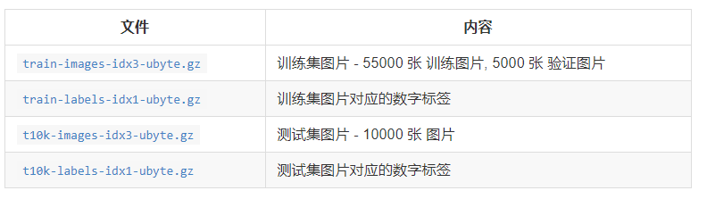
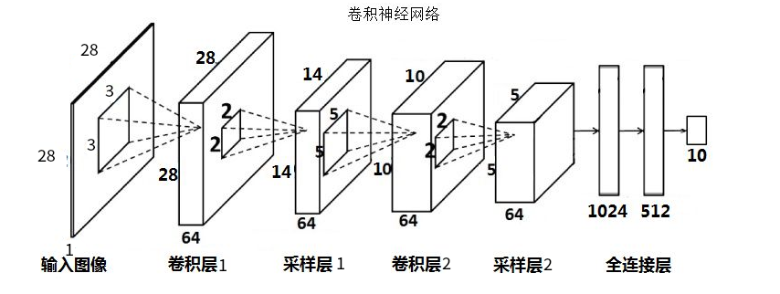
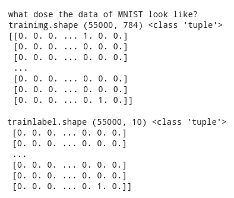

​        本文主要讲述了利用tensorflow搭建的卷积神经网络模型并将其用于手写数字识别，训练的数据集是MNIST，MNIST是在机器学习领域中的一个经典问题。该问题解决的是把28x28像素的灰度手写数字图片识别为相应的数字，其中数字的范围从0到9。[数据集下载链接]( <http://yann.lecun.com/exdb/mnist/>)，也可直接引入tensorflow的minist数据集库，如下所示：

```
from tensorflow.examples.tutorials.mnist import input_data
```

数据集结构包含内容如下：



神经网络模型如下



其中，卷积层1使用64个大小3x3x1，步长s = 1的过滤器；采样层1使用64个大小为2x2x64的maxPooling进行采样，卷积层2使用64个大小5x5x64，步长s = 1的过滤器；采样层2使用64个大小为2x2x64的maxPooling进行采样，全连接层1有1024个神经元，全连接层2有512个神经元，输出层使用softmax分类器。

下面我们开始用tensorflow实现上图的卷积神经网络模型。

（1）首先引入所需要的库以及数据集：

```
import numpy as np 
import tensorflow as tf 
import matplotlib.pyplot as plt 
from tensorflow.examples.tutorials.mnist import input_data
import cv2
```

加载数据集：

```
print("Download and Extract MNIST dataset")
mnist = input_data.read_data_sets('data/', one_hot = True)
print("type of 'mnist' is %s " %(type(mnist)))
print("number of train data is %d" %(mnist.train.num_examples))
print("number of test data is %d" %(mnist.test.num_examples))
```

运行结果如下：

> Download and Extract MNIST dataset 
>
> Extracting data/train-images-idx3-ubyte.gz
>
> Extracting data/train-labels-idx1-ubyte.gz 
>
> Extracting data/t10k-images-idx3-ubyte.gz 
>
> Extracting data/t10k-labels-idx1-ubyte.gz 
>
> type of 'mnist' is <class 'tensorflow.contrib.learn.python.learn.datasets.base.Datasets'>  
>
> number of train data is 55000 
>
> number of test data is 10000

获取数据集：

```
trainimg = mnist.train.images
trainlabel = mnist.train.labels
testimg = mnist.test.images
testlable = mnist.test.labels
```

运行以下代码查看数据集大小：

```
print("what dose the data of MNIST look like?")
print("trainimg.shape", trainimg.shape, type(trainimg.shape),train)
print("trainlabel.shape", trainlabel.shape, type(trainlabel.shape),trainlabel)
```

结果如下：



(2) 参数初始化

根据卷积神经网络确定各层参数，并对其初始化：

```
#n_input：每一个数据集的输入，MINIST数据集的大小为28x28=784。
#n_output: 每一个数据集对应一个输出，0~9一共10种可能。
n_input = 784
n_output = 10

#tf.random_normal([filter_height, filter_width, in_channels, out_channels],stddev= a)
#神经网络模型的各个参数采用高斯初始化，指定方差stddev=0.1
#tf.random_normal([3, 3, 1, 64])表示一共64个filter,即输出为64层;每个filter大小[3*3*1],深度是1
weights = {
  'wc1': tf.Variable(tf.random_normal([3, 3, 1, 64], stddev = 0.1)),
  'wc2': tf.Variable(tf.random_normal([5, 5, 64, 64], stddev = 0.1)),
  'wd1': tf.Variable(tf.random_normal([5*5*64, 1024], stddev = 0.1)),
  'wd2': tf.Variable(tf.random_normal([1024, 512], stddev = 0.1)),
  'wd3': tf.Variable(tf.random_normal([512, n_output], stddev = 0.1))
}
biases = {
  'bc1': tf.Variable(tf.random_normal([64], stddev = 0.1)),
  'bc2': tf.Variable(tf.random_normal([64], stddev = 0.1)),
  'bd1': tf.Variable(tf.random_normal([1024], stddev = 0.1)),
  'bd2': tf.Variable(tf.random_normal([512], stddev = 0.1)),
  'bd3': tf.Variable(tf.random_normal([n_output], stddev = 0.1))
} 
```

其中：wc i 表示卷积层 i 的过滤器的大小，wd i 表示全连接层 i 的参数，bc i 表示卷积层 i 的偏置，bd i 表示全连接层 i 的偏置。

(3)  构建卷积神经网络模型

```
def conv_basic(_input, _w, _b, _keepratio):
  #对输入进行预处理，转为tensorflow要求的格式：四维[n, h, w, c]
  #n:batch_size;h,w图像的高度宽度;c图片的深度(rgb图：c=3，灰度图c=1)
  #-1：表示tensorflow自行计算大小
  _input_r = tf.reshape(_input, shape=[-1, 28, 28, 1])
 
  #卷积层1
  #strides四维分别表示[batch, height, width, channels]
  #padding:`"SAME",或 "VALID"`. 'SAVE'可以自动计算补0,完成完整卷积，‘VALID’忽略无法计算的部分。
  _conv1 = tf.nn.conv2d(_input_r, _w['wc1'], strides = [1, 1, 1, 1], padding = 'SAME')
  #relu激活
  _conv1 = tf.nn.relu(tf.nn.bias_add(_conv1, _b['bc1']))
 
  #maxpooling池化1
  #ksize: [batch, height, width, channels],ksize = [1, 2, 2, 1]表示池化大小2x2,步长1.
  _pool1 = tf.nn.max_pool(_conv1, ksize = [1, 2, 2, 1], strides = [1, 2, 2, 1], padding = 'SAME')
  #tf.nn.dropout()随机杀死结点;_keepratio保留的比例
  _pool_dr1 = tf.nn.dropout(_pool1, _keepratio)

  #卷积层2
  _conv2 = tf.nn.conv2d(_pool_dr1, _w['wc2'], strides = [1, 1, 1, 1], padding = 'VALID')
  _conv2 = tf.nn.relu(tf.nn.bias_add(_conv2, _b['bc2']))
  #池化2
  _pool2 = tf.nn.max_pool(_conv2, ksize = [1, 2, 2, 1], strides = [1, 2, 2, 1],  padding = 'SAME')
  _pool_dr2 = tf.nn.dropout(_pool2, _keepratio)  

  #将池化层的结果向量化
  _dense1 = tf.reshape(_pool_dr2, [-1, _w['wd1'].get_shape().as_list()[0]])
  #全连接层1
  _fc1 = tf.nn.relu(tf.add(tf.matmul(_dense1, _w['wd1']), _b['bd1']))
  _fc_dr1 = tf.nn.dropout(_fc1, _keepratio)

  #全连接层2
  _fc2 = tf.nn.relu(tf.add(tf.matmul(_fc_dr1 , _w['wd2']), _b['bd2']))
  _fc_dr2 = tf.nn.dropout(_fc2, _keepratio)

  #输出层
  _out = tf.add(tf.matmul(_fc_dr2, _w['wd3']), _b['bd3'])  

  #将计算结果返回
  return _out
```

(4) 创建变量用于接收数据

```
x = tf.placeholder(tf.float32, [None, n_input])
y = tf.placeholder(tf.float32, [None, n_output])
keepratio = tf.placeholder(tf.float32)

```

(5) 设置优化器，计算准确度accr

```
#传入参数，获得计算结果
_pred = conv_basic(x, weights, biases, keepratio)

#求出交叉熵取均值：即为cost值
cost = tf.reduce_mean(tf.nn.softmax_cross_entropy_with_logits(logits = _pred, labels = y))
#Adam算法的优化器 
optm = tf.train.AdamOptimizer(learning_rate = 0.001).minimize(cost)    


#tf.argmax(_pred, 1):返回_pred中最大值的下标
_corr = tf.equal(tf.argmax(_pred, 1), tf.argmax(y, 1))
y_predict = tf.argmax(_pred, 1)

#tf.cast: 将布尔数组转化为1,0。例如：[True, False, True, True]变为[1,0,1,1]
#tf.reduce_mean计算均值
accr = tf.reduce_mean(tf.cast(_corr, tf.float32))
```

(6) 初始化图，设置保存器

```
init = tf.global_variables_initializer()

#设置保存器
save_step = 1
#max_to_keep = 3 保存参数的个数
saver = tf.train.Saver(max_to_keep = 3)        
print("graph ready")
sess = tf.Session()
sess.run(init)
```

(7) 传入数据开始训练并保存参数

```
training_epochs = 15          #训练次数

batch_size = 128              #每个batch的大小
display_step = 5              #每隔5打印一次                 

#通过循环进行训练，次数为：training_epochs
for epoch in range(training_epochs):
  avg_cost = 0                           #平均损失大小
  total_batch = int(mnist.train.num_examples/batch_size)        #将数据集分为total_batch份
 
 #训练每一个batchise
  for i in range(total_batch):
    batch_xs, batch_ys = mnist.train.next_batch(batch_size)
    sess.run(optm, feed_dict = {x:batch_xs, y: batch_ys, keepratio: 0.7})
    avg_cost += sess.run(cost,feed_dict = {x:batch_xs, y: batch_ys, keepratio: 1}) / total_batch

  #打印准确度
  if epoch % display_step ==0:
    print("Epoch: %03d/%03d cost: %.9f" %(epoch, training_epochs, avg_cost))
    feeds = {x: batch_xs, y: batch_ys, keepratio: 1.0}
    train_cc = sess.run(accr, feed_dict = feeds)
    print("train accuracy: %.3f" %(train_cc))
      
  #保存参数
  if epoch % save_step == 0:
    saver.save(sess, 'save/nets/cnn_mnist_basic.ckpt-' + str(epoch))
    print("save",epoch)
print("optimization finish") 
tf.reset_default_graph()         #清空session      
```

(8) 读取保存的参数并进行测试

利用测试集进行测试

```
print('begin-test')
#读取保存的参数
saver.restore(sess, 'save/nets/cnn_mnist_basic.ckpt-' + str(13)) 
#开始测试
feeds = {x: mnist.test.images, y: mnist.test.labels, keepratio: 1.0}
_pred_y = sess.run(_pred, feed_dict = feeds)
pred_y = sess.run(y_predict, feed_dict = feeds)
test_cc = sess.run(accr, feed_dict = feeds)
#输出准确度
print("test accuracy: %.3f" %(test_cc))
tf.reset_default_graph()
```


测试一张图片

```
print('begin-test')
#读取图片
image = cv2.imread('0.png')
print('image', image.shape)
#转为灰度图
_gray = cv2.cvtColor(image, cv2.COLOR_BGR2GRAY)
gray = _gray.reshape([-1, 784])
print('gray',type(_gray),gray.shape)
#读取保存的参数
saver.restore(sess, 'save/nets/cnn_mnist_basic.ckpt-' + str(13))
#开始测试
feeds = {x:gray, keepratio: 1.0}
_pred_y = sess.run(_pred, feed_dict = feeds)
pred_y = sess.run(y_predict, feed_dict = feeds)
#输出结果
print('_pred' ,_pred_y)
print('pred_y', pred_y)
#清空图
tf.reset_default_graph()      
```

(完整代码请在此处下载)[]