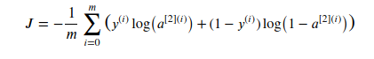

用python实现一个简单的神经网络模型：

## 一：神经网络模型的基本概况


该神经网络的输入数据为x1，x2，输入数据维度n_x = 2；隐藏层神经元个数为n_h=4，a^[1]表示隐藏层的输出，y帽（即a[2]）表示最终的输出结果，输出数据维度n_y = 1；隐藏层的激活函数为tanh()；输出层的激活函数为sigmoid()。

正向传播计算过程如下：


注：其中W[1]的维度为(n_h, n_x)；b[1]的维度为(n_h, 1)；W[2]的维度(n_y, n_h)；b[2]的维度(n_y, 1)。

利用如下公式计算损失函数：



为了得到最佳的参数，我们要进行反向传播对参数进行更新，更新过程基于梯度下降法，利用链式求导法则计算结果如下（具体推到过程可以参考笔者的另一篇博客：http://zyzblog.top/article/16）：


最终更新公式（a为学习率）：


## 二： 神经网络的代码实现

本文是基于 Anaconda 提供的 python3.7 以及以下库的支持：

- [numpy](https://www.zxxblog.cn/article/www.numpy.org) 不多说了，科学计算必备的库
- [sklearn](http://scikit-learn.org/stable/) 提供一些用于数据分析的 样本 和 高效率工具
- [matplotlib](http://matplotlib.org/) 利用python进行绘图的库. 

另外，我们还需要借助一些吴恩达老师提供的工具函数testCases.py 和 planar_utils.py（[可以从这个链接下载](https://github.com/zxxwin/DLnote/tree/master/python%20code/Neural%20Network)）：

- testCases 提供测试样本来评估我们的模型。provides some test examples to assess the correctness of your functions
- planar_utils 提供各种有用的函数

引入我们所需的库函数：

```
# Package imports
import numpy as np
import matplotlib.pyplot as plt
from testCases import *
import sklearn
import sklearn.datasets
import sklearn.linear_model
from planar_utils import plot_decision_boundary, sigmoid, load_planar_dataset, load_extra_datasets
```

初始化神经网络模型的基本参数：

    def layer_sizes(X, Y):
    
        n_x = X.shape[0] # 输入层单元数量
    
        n_h = 4          # 隐藏层单元数量，在这个模型中，我们设置成4即可
    
        n_y = Y.shape[0] # 输出层单元数量
        
       return (n_x, n_h, n_y)

使用随机初始化函数初始化参数矩阵：W, b。具体代码如下：

    def initialize_parameters(n_x, n_h, n_y):
    
        W1 = np.random.randn(n_h, n_x) * 0.01
    
        b1 = np.zeros((n_h, 1))
    
        W2 = np.random.randn(n_y, n_h) * 0.01
    
        b2 = np.zeros((n_y, 1))
    
       parameters = {"W1": W1,
                     "b1": b1,
                     "W2": W2,
                     "b2": b2}
    
       return parameters
正向传播的计算过程用代码实现如下：

```
def forward_propagation(X, parameters):
    # 从parameters中取出参数
    W1 = parameters["W1"]
    b1 = parameters["b1"]
    W2 = parameters["W2"]
    b2 = parameters["b2"]
    
    # 执行正向传播操作
    Z1 = np.dot(W1, X) + b1
    A1 = np.tanh(Z1)
    Z2 = np.dot(W2, A1) + b2
    A2 = sigmoid(Z2)
    
    cache = {"Z1": Z1,
             "A1": A1,
             "Z2": Z2,
             "A2": A2}
    
    return A2, cache
```

计算损失函数：

```
def compute_cost(A2, Y, parameters):
    m = Y.shape[1] # 样本个数

    # 下一行的结果是 (1, m)的矩阵
    logprobs = np.multiply(Y, np.log(A2)) + np.multiply(1-Y, np.log(1 - A2)) 
    
    # 将 (1, m)的矩阵求和后取平均值
    cost = - 1/m * np.sum(logprobs) 
    
    # np.squeeze()函数对矩阵进行压缩维度，删除单维度条目，即把shape中为1的维度去掉
    # 例如： np.squeeze([[ 1.23 ]]) 可以将维度压缩，最终变成 1.23
    # 目的是确保 cost 是一个浮点数
    cost = np.squeeze(cost)     
    
    return cost
```

反向传播目的是计算梯度，所需要的参数保存在cache中，cache将作为反向传播的输入参数，以下为 反向传播的代码实现： 

```
def backward_propagation(parameters, cache, X, Y):
    # 获取样本的数量
    m = X.shape[1]
    
    # 从 parameters 和 cache 中取得参数
    W1 = parameters["W1"]
    W2 = parameters["W2"]
    A1 = cache["A1"]
    A2 = cache["A2"]
    
    # 计算梯度 dW1, db1, dW2, db2. 
    dZ2 = A2 - Y
    dW2 = 1/m * np.dot(dZ2, A1.T)
    db2 = 1/m * np.sum(dZ2, axis = 1, keepdims = True)
    dZ1 = np.multiply(np.dot(W2.T, dZ2), 1 - np.power(A1, 2))
    dW1 = 1/m * np.dot(dZ1, X.T)
    db1 = 1/m * np.sum(dZ1, axis = 1, keepdims = True)
    
    grads = {"dW1": dW1,
             "db1": db1,
             "dW2": dW2,
             "db2": db2}
    
    return grads
```

各参数更新的梯度大小保存在grads中，根据梯度下降法则对参数进行更新，其中learning_rate为学习率，代码如下：

```

def update_parameters(parameters, grads, learning_rate = 1.2):
    W1 = parameters["W1"]
    b1 = parameters["b1"]
    W2 = parameters["W2"]
    b2 = parameters["b2"]
    
    dW1 = grads["dW1"]
    db1 = grads["db1"]
    dW2 = grads["dW2"]
    db2 = grads["db2"]
    
    
    # 更新参数
    W1 -= learning_rate * dW1
    b1 -= learning_rate * db1
    W2 -= learning_rate * dW2
    b2 -= learning_rate * db2
    
    parameters = {"W1": W1,
                  "b1": b1,
                  "W2": W2,
                  "b2": b2}
    
    return parameters
```

注：梯度的大小决定了更新的快慢。

利用上述函数构建完整的神经网络模型如下：

```
def nn_model(X, Y, n_h, num_iterations = 10000, print_cost=False):
    # 输入层单元数
    n_x = layer_sizes(X, Y)[0] 
    # 输出层单元数
    n_y = layer_sizes(X, Y)[2] 
    
    # 随机初始化参数
    parameters = initialize_parameters(n_x, n_h, n_y) 
    W1 = parameters["W1"]
    b1 = parameters["b1"]
    W2 = parameters["W2"]
    b2 = parameters["b2"]
    
    # 10000次梯度下降的迭代
    for i in range(0, num_iterations):
        # 正向传播，得到Z1、A1、Z2、A2
        A2, cache = forward_propagation(X, parameters)
        
        # 计算成本函数的值
        cost = compute_cost(A2, Y, parameters)
 
        # 反向传播，得到各个参数的梯度值
        grads = backward_propagation(parameters, cache, X, Y)
 
        # 更新参数
        parameters = update_parameters(parameters, grads, learning_rate = 1.2)
        
        # 每迭代1000下就输出一次cost值
        if print_cost and i % 1000 == 0:
            print ("Cost after iteration %i: %f" %(i, cost))

    # 返回最终训练好的参数
    return parameters
```

以下为预测函数，利用正向传播进行结果的预测，具体代码如下：

```
def predict(parameters, X):
    A2, cache = forward_propagation(X, parameters)
    predictions = (A2 > 0.5)
    
    return predictions

```

到此，神经网络模型构建完成。

## 三： 利用神经网络模型进行简单预测

具体代码如下：

```
X, Y = load_planar_dataset() 
# 利用含有4个神经元的单隐藏层的神经网络构建分类模型
parameters = nn_model(X, Y, n_h = 4, num_iterations = 10000, print_cost=True)

# 可视化分类结果
plot_decision_boundary(lambda x: predict(parameters, x.T), X, Y)
plt.title("Decision Boundary for hidden layer size " + str(4))
plt.show()

# 输出准确率
predictions = predict(parameters, X)
print ('准确率: %d' % float((np.dot(Y,predictions.T) + np.dot(1-Y,1-predictions.T))/float(Y.size)*100) + '%')
```

程序的输出如下：

> 


## 四：使用不同个数的隐藏层单元

可以尝试隐藏层有1, 2, 3, 4, 5, 10, 20个单元会怎么样：

```python
plt.figure(figsize=(16, 32))
hidden_layer_sizes = [1, 2, 3, 4, 5, 10, 20]
for i, n_h in enumerate(hidden_layer_sizes):
  plt.subplot(5, 2, i+1)
  plt.title('Hidden Layer of size %d' % n_h)
  parameters = nn_model(X, Y, n_h, num_iterations = 5000)
  plot_decision_boundary(lambda x: predict(parameters, x.T), X, Y)
  predictions = predict(parameters, X)
  accuracy = float((np.dot(Y,predictions.T) + np.dot(1-Y,1-predictions.T))/float(Y.size)*100)
  print ("Accuracy for {} hidden units: {} %".format(n_h, accuracy))
```

这是我的输出结果：

```
Accuracy for 1 hidden units: 67.5 %
Accuracy for 2 hidden units: 67.25 %
Accuracy for 3 hidden units: 90.75 %
Accuracy for 4 hidden units: 90.5 %
Accuracy for 5 hidden units: 91.25 %
Accuracy for 10 hidden units: 90.25 %
Accuracy for 20 hidden units: 90.0 %
```


更多的隐藏层单元可以更好的拟合训练数据，最终会导致过分拟合输入数据，导致模型的泛用性降低。

之后我们会学习正则化，这样即使有50个单元也不会出现过拟合的情况。

完整代码请从本处下载：