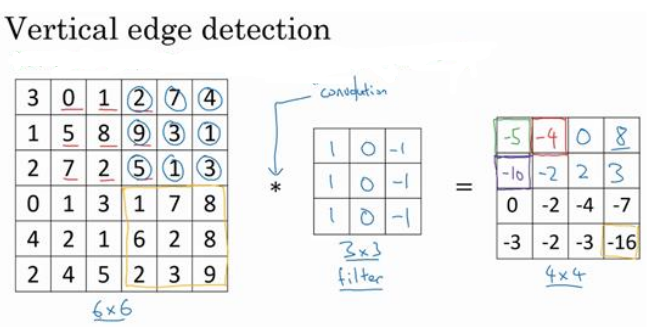
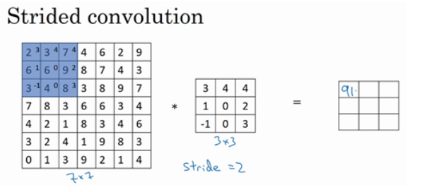
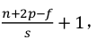

## 1. 卷积层的计算

首先了解以下卷积运算的过程：

看一个例子,下图一个 6×6 的灰度图像的像素值。因为是灰度图像,所以它是 6×6×1 的矩阵,而
不是 6×6×3 （ 无RGB 三通道）。对这个 6×6 的图像进行卷积运算,卷积运算用“∗”来表示,用 3×3
的过滤器对其进行卷积。

具体计算方法如下：

(1) 计算第一个输出值： 将3×3 的过滤器覆盖在输入图像,如下图所示：

然后进行元素乘法：

然后将该矩阵每个元素相加，得到最左上角的元素,即3 + 1 + 2 + 0 + 0 + 0 + (−1) + (−8) + (−2) = −5。

(2) 计算第一行的第二个输出值，把蓝色的方块,向右移动一步，如下图所示：

继续做同样的元素乘法,然后加起来,所以是 0 × 1 + 5 × 1 + 7 × 1 + 1 × 0 + 8 × 0 + 2 × 0 + 2 × (−1) + 9 × (−1) + 5 × (−1) = −4，所以：

不断循环，直到第一行输出计算完毕，蓝色方块下移，计算第二行输出。如下图所示：

重复进行元素乘法,然后加起来。得到第二行的第一个输出为-10。

最终计算结果如下：

了解了以上计算过程后，我们还要知道3x3的过滤器中的9个数字是怎么得到的？如下图所示：

这 9 个数字是卷积神经网络模型中的参数，通常先给定一组初始值，在训练的过程中，让神经网络学习这 9 个数字，最终得到一组最优参数。输入的图片矩阵经过不同的参数的过滤器处理后会达到不同的效果，下面介绍一下水平边缘检测滤波器和垂直边缘滤波器及其作用：

(1)下图的输入是一张6x6的图片，左边较亮,而右边较暗,  它与垂直边缘检测滤波器进行卷积,检测结果就显示在了右边这幅图的中间部分。

 (2) 下图的输入图片是一张左上方和右下方都是亮度为 10 的点，右上方和左下方比较暗。用这幅图与水平边缘过滤器卷积,就会得到右边这个矩阵。

右边矩阵中绿色方框标记元素30代表了左边矩阵绿色方框标记的3×3 的区域，这块区域确实是上边比较亮,而下边比较暗的,所以它在这里发现了一条正边缘。而右边矩阵中紫色方框标记元素-30代表了左边矩阵紫色方框标记部分，这块区域底部比较亮,而上边则比较暗,所以在这里它是一条负边。

​        为了构建深度神经网络,卷积操作 padding是必不可少的，下面简单介绍padding。

​        从卷积的计算过程可知：用一个 3×3 的过滤器卷积一个 6×6 的图像,最后会输出一个4x4的矩阵。因为3×3 过滤器在 6×6 矩阵中,只可能有 4×4 种可能的位置。这背后的数学解释是,如果我们有一个n × n的图像,用f × f的过滤器做卷积,那么输出的维度就是(n − f + 1) × (n − f + 1)。这样会带来两个缺点：

- 每次做卷积操作,你的图像就会缩小,从 6×6 缩小到 4×4,几次卷积之后,你的图像就会变得很小了,可能会缩小到只有 1×1 的大小。
- 角落边缘的像de素点只被一个输出所触碰或者使用,因为它位于这个 3×3 的区域的一角。而中间的像素点,就会有许多 3×3 的区域与之重叠。所以那些在角落或者边缘区域的像素点在输出中采用较少,意味着你丢掉了图像边缘位置的许多信息。

为了解决这些问题,可以在卷积操作之前填充这幅图像，也就是padding操作。

如下图所示，用0将6x6的输入填充成8x8的图片，

用p表示填充数量,在周围都填充了一个像素点,输出也就变成了(n + 2p − f + 1) × (n + 2p − f + 1)。当p = 1时，就变成了(6 + 2 × 1 − 3 + 1) × (6 + 2 × 1 −3 + 1) = 6 × 6,和输入的图像一样大。这样一来,丢失信息或者更准确来说角落或图像边缘的信息发挥的作用较小的这一缺点就被削弱了。

了解一下 Valid 卷积和 Same 卷积这两个概念：

- Valid 卷积意味着不填充,一个n × n的图像,用一个f × f的过滤器卷积,它将会给你一个(n − f + 1) × (n − f + 1)维的输出。
- Same 卷积,意味你填充后,你的输出大小和输入大小是一样的。填充后输出公式为n + 2p − f + 1。如果想让n + 2p − f + 1 = n的话,即输出和输入大小相等,可以解得p = (f − 1)/2。

## 2. 卷积步长(Strided convolutions)

卷积中的步幅是另一个构建卷积神经网络的基本操作,下面是个具体例子：

用 3×3 的过滤器卷积 7×7 的图像,和之前不同的是,把步幅设置成了2，计算过程如下：

和之前一样取左上方的 3×3 区域的元素的乘积,再加起来,最后结果为 91。之前我们移动蓝框的步长是 1,现在移动的步长是 2,让过滤器跳过 2 个步长,跳到如图所示的位置。然后你还是将每个元素相乘并求和,你将会得到的结果是 100。

同理，当你移动到下一行的时候,你也是使用步长 2 而不是步长 1,所以我们将蓝色框移动到这里:

接下来的计算过程相同，大体如下：

由上述过程可知：步长影响输出，用一个f × f的过滤器卷积一个n × n的图像, padding 为p,步幅为s,输入和输出的维度是由下面的公式决定的：

注：正确计算输出维度的方法是向下取整,以免不是整数。

## 3. 三维卷积

如果理解了上述二维卷积的计算方式，三维卷积就不难理解。

​      为了计算这个卷积操作的输出,如下图所示，把这个 3×3×3 的过滤器先放到最左上角的位置,这个 3×3×3 的过滤器有 27 个数,。依次取这 27 个数,乘以相应的红绿蓝通道中的数字。先取红色通道的前 9 个数字,然后是绿色通道,然后再是蓝色通道,乘以左边黄色立方体覆盖的对应的 27 个数,然后把这些数都加起来,就得到了输出的第一个字。

如果要计算下一个输出,你把这个立方体滑动一个单位(假设步幅s =1),再与这 27 个数相乘,把它们都加起来,就得到了下一个输出,如下图所示，以此类推。

以上计算过程就是对立方体卷积,还有最后一个概念,对建立卷积神经网络至关重要。如果你想同时用多个过
滤器怎么办?如下图所示：

​       计算过程如下：对第一个过滤器卷积,可以得到第一个 4×4 的输出,然后卷积第二个过滤器,得到一个不同的 4×4 的输出。把这两个输出堆叠在一起,得到了一个 4×4×2 的输出立方体。

​       总结一下维度,如果你有一个n × n × n c (通道数)的输入图像,在这个例子中就是 6×6×3,这里的n c 就是通道数目,然后卷积上一个f × f × n c ,这个例子中是 3×3×3,按照惯例,这个(前一个n c )和这个(后一个n c )必须数值相同。然后你就得到了 ( n + 2p − f + 1 )× ( n + 2p − f + 1 ) × n c ′ ,这里n c ′ 是过滤器的个数。

## 4.单层卷积网络

单层卷积网络的计算过程如下图所示：

​        图中输入X即a[0] ,两个3x3x3的过滤器用变量W [1] 表示，一共3x3x3x2=54个参数。在卷积过程中，对输入和参数做卷积乘法，它的作用类似于W [1] a [0] ,卷积结果得到两个 4×4 矩阵的输出结果,然后加上偏差。然后计算激活函数，得新的矩阵。把两个新的4x4的矩阵拼接在一起，得到的这个 4×4×2 矩阵,成为神经网络的下一层。

​         这就是a [0] 到a [1] 的计算过程,首先是运用线性函数(卷积计算)再加上偏差,然后应用激活函数 ReLU。这样就通过神经网络的一层把一个6×6×3 的维度a [0] 演化为一个 4×4×2 维度的a [1] ,这就是卷积神经网络的一层。

​         示例中有两个过滤器,我们提取了两个特征得到一个 4×4×2 的输出。如果用了 10 个过滤器,我们会提取10 个特征，会得到一个 4×4×10 维度的输出图像。

​        由上面的计算过程，有如下结论：

第 l 层输出图像的高度：

第 l 层输出图像的宽度：

第 l 层过滤器维度：

注：第 l 层输出图像的深度(通道数)就是神经网络中这一层所使用的过滤器的数量。

## 5. 池化层

举个例子说明什么是池化层（以最大池化为例）：

​        假设输入是一个 4×4 矩阵，执行最大池化的树池是一个 2×2 矩阵。执行过程如图所示：把 4×4 的输入拆分成不同的区域,我把这个区域用不同颜色来标记。对于 2×2的输出,输出的每个元素都是其对应颜色区域中的最大元素值。左上区域的最大值是 9,右上区域的最大元素值是 2,左下区域的最大值是 6,右下区域的最大值是 3。这是一个 2×2 矩阵,即f = 2,步幅是 2,即s = 2。

​         在池化层中，一旦确定了 f 和 s ,它就是一个固定运算,梯度下降无需改变任何值。最大池化的输出也固定了，和卷积层输出计算公式一样：

下面是超参数f = 3,s = 1的池化过程：

以上是最大池化的例子，还存在一种平均池化，不是取最大值，而是计算每一个池化的平均值。

## 6. 卷 积 神 经 网 络 示 例          

 (1) 构建卷积层Layer1

​       假设输入是 32×32×3 的矩阵,假设第一层使用过滤器大小为 5×5,步幅是 1, padding是 0,过滤器个数为 6,那么输出为 28×28×6。将这层标记为 CONV1,它用了 6 个过滤器,增加了偏差,应用了非线性函数,最后输出 CONV1 的结果。如下图所示：

​       然后构建一个池化层,选择用最大池化过滤器为大小 2×2,步幅为 2，计算可知高度和宽度会减少一半。因此,28×28 变成了 14×14,通道数量保持不变,所以最终输出为 14×14×6,将该输出标记为 POOL1。如下图所示：

将卷积层conv1和池化层pool1一起作为一层,这就是神经网络的 Layer1。

 (2) 构建卷积层Layer2        

​        继续构建一个卷积层,用 16 个过滤器大小为 5×5,步幅为 1,最后输出10×10×16 的矩阵,记CONV2。然后做最大池化,超参数f = 2,s = 2。计算得高度和宽度会减半,最后输出为 5×5×16,记为 POOL2,这就是神经网络的第二个卷积层 Layer2。如下图所示：

 (3) 构建全连接层FC3

​         最后的输出5×5×16 矩阵包含 400 个元素,将 POOL2 平整化为一个大小为 400 的一维向量。即400个神经元集合,然后利用这 400 个单元构建下一层。下一层含有 120 个单元,这就是我们第一个"全连接层",标记为 FC3，这是一个标准的神经网络,它的权重矩阵为W [3] ,维度为 120×400。这就是所谓的“全连接”,因为这 400 个单元与这 120 个单元的每一项连接,还有一个偏差参数。如下图所示：

 (3) 构建全连接层FC4以及输出层

​      对这个 120 个单元再添加一个全连接层,这层更小,假设它含有 84 个单元,标记为 FC4。用这 84 个单元填充一个 softmax 单元。如果我们想通过手写数字识别来识别手写 0-9 这 10 个数字,这个 softmax 就会有 10 个输出。如下图所示：

到此，神经网络构建完毕。

如何训练神经网络？比如我们要构建一个猫咪检测器，x表示一张图片的输入，我们选定了一个卷积神经网络,输入图片,增加卷积层和池化层,然后添加全连接层,最后输出一个softmax，即y{hat}。卷积层和全连接层有不同的参数w和偏差b，随机初始化其参数w和b。定义代价 函 数 J 等 于 神 经 网 络 对 整 个 训 练 集 的 预 测 的 损 失 总 和 再 除 以 m，接下来，要使用梯度下降法来优化神经网络中的所有参数。

## 7. 为什么使用卷积?

卷积层主要有以下两个优势：

- 参数共享：如果你用一个 3×3 的过滤器检测垂直边缘,图片的各个区域都可以使用这个过滤器。每个特征检测器以及输出都可以在输入图片的不同区域中使用同样的参数,以便提取垂直边缘或其它特征，实现参数共享。

- 稀疏连接：通过以下例子来说明，如图所示：

图中的蓝色框中的 0 是通过 3×3 的卷积计算得到的,它依赖于这个 3×3 的输入的单元格,仅与 36 个输入特征中 9 个
相连接。而且其它像素值都不会对输出产生任影响,这就是稀疏连接的概念。

神经网络可以通过这两种机制减少参数,以便我们用更小的训练集来训练它,从而预防过度拟合。

