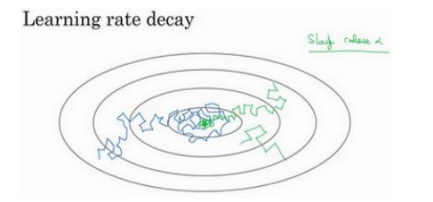
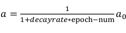
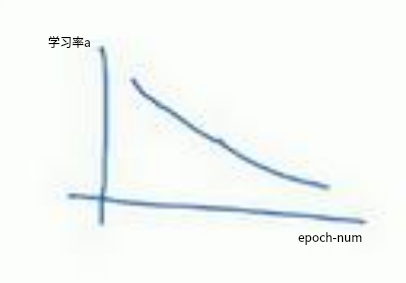
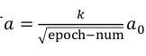
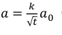

​        学习率衰减是指，在神经网络模型训练过程中，为了加快训练速度，慢慢减少学习率。学习率a衰减的本质在于：在学习初期,你能承受较大的步伐,但当开始收敛的时候,小一些的学习率能让你步伐小一些。

​        如图所示，在使用mini-batch梯度下降法时，在迭代过程中会有噪音(蓝色线)，因为学习率a是固定值，算法最后在最小值附近摆动,并不会真正收敛。

​	如果在训练的过程慢慢减少学习率a,在初期的时候, a较大,学习还是相对较快,但随着a变小,步伐也会变慢变小,所以最后你的曲线(绿色线)会在最小值附近的一小块区域里摆动,而不是大幅度在最小值附近摆动。

在mini-batch梯度下降法中，学习率衰减通常使用的计算方法如下：

注：decay-rate称为衰减率(需要调整的超参数),epoch-num 为代数,α 0 为初始学习率。

学习率衰减也可使用以下几个公式：

