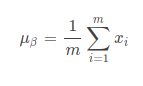
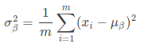
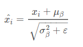
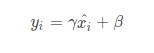
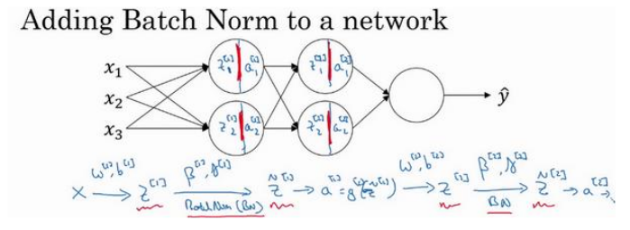
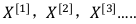
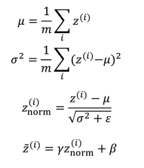

## 输入归一化

​       为了加快训练神经网络的速度,我们可以对输入数据进行归一化操作，在测试时，我们也要对测试集进行相同的归一化操作；假设一个训练集有两个特征,输入特征为 2 维,归一化需要两个步骤:

1.零均值
2.归一化方差;

假设初始训练集分布如下图：

第一步是零均值化,具体计算方法如下：

这是一个向量,X是所有训练集组成的矩阵，令X等于X减去μ, 实际意义是移动训练集,完成零均值化。经过零均值化，训练集的分布变成下图：

第二步是归一化方差，具体计算方法如下：

它是一个向量，X是所有训练集组成的矩阵，令X等于X / σ 2，经过归一化方差，训练集的分布变成下图：

为什么要这么做能够加快训练速度?我们从损失函数 J 说起，代价函数如下：

如果没有进行归一化的输入特征,代价函数细长狭窄，如下图所示：

在这样的代价函数上运行梯度下降法,必须使用一个非常小的学习率。因为梯度下降法可能需要多次迭代过程,直到最后找到最小值。

如果你归一化特征,代价函数呈现球形轮廓，如下图所示：

这种情况下，不论从哪个位置开始,梯度下降法都能够更直接地找到最小值,也可使用较大步长。

## Batch归一化

​       如果我们只对输入的数据进行归一化，却没有在中间层进行归一化处理，随着深度网络的多层运算之后，数据分布的变化将越来越大，因此我们应该对每一个隐藏层的输入a[l-1]也可以进行归一化操作，严格来说,真正归一化的不是a[l - 1],而是z [l - 1] 。主要计算公式如下：

(1) 求上一层输出数据的均值：

注：m是当前mini-batch的大小。 

(2) 求上一层输出数据的标准差:

(3) 归一化处理:

注： ε是为了避免分母为0而加进去的接近于0的数 

对经过上面归一化处理得到的数据进行重构，得到如下公式：

注：γ和β学习参数

将 Batch Norm 拟合进神经网络 ，具体计算方法如图：

也就是对每一个隐藏层的输入进行归一化计算，将归一化的结果做为激活函数的输入，最终得出计算结果。

Batch归一化的作用：

- 通过归一化所有的输入特征值x,可以加速学习。

- Batch 归一化解决了输入值改变的问题,使得所有的输入值在一定的范围内，使得神经网络的所有隐藏层的输入更稳定,它减弱了前层参数的作用与后层参数的作用之间的联系，它使得网络每层都可以自己学习。

- 如果神经元的数据分布改变，我们也许需要重新训练数据以拟合新的数据分布，batch归一化可以确保,无论其怎样变化,其均值和方差将保持不变，避免重新训练数据。

- Batch 归一化还有一个作用,它有轻微的正则化效果，避免过拟合。

  

## 测试时的 Batch Norm

为了将神经网络运用于测试，需要单独估算μ和σ^2 ,在典型的 Batch 归一化运用中,需要用一个指数加权平均来估算,这个平均数涵盖了所有 mini-batch。

假设有 mini-batch

