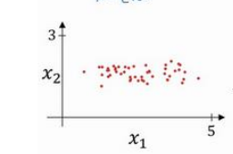
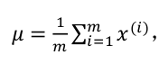
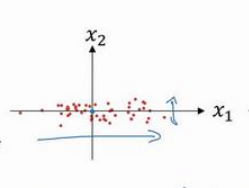
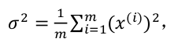
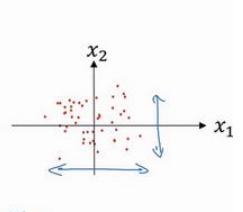
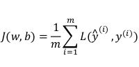
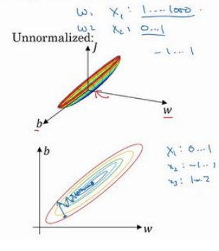
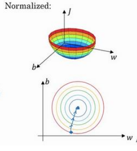

​       为了加快训练神经网络的速度,我们可以对输入数据进行归一化操作，在测试时，我们也要对测试集进行相同的归一化操作；假设一个训练集有两个特征,输入特征为 2 维,归一化需要两个步骤:

1.零均值
2.归一化方差;

假设初始训练集分布如下图：

第一步是零均值化,具体计算方法如下：

这是一个向量,X是所有训练集组成的矩阵，令X等于X减去μ, 实际意义是移动训练集,完成零均值化。经过零均值化，训练集的分布变成下图：

第二步是归一化方差，具体计算方法如下：

它是一个向量，X是所有训练集组成的矩阵，令X等于X / σ 2，经过归一化方差，训练集的分布变成下图：

为什么要这么做能够加快训练速度?我们从损失函数 J 说起，代价函数如下：

如果没有进行归一化的输入特征,代价函数细长狭窄，如下图所示：

在这样的代价函数上运行梯度下降法,必须使用一个非常小的学习率。因为梯度下降法可能需要多次迭代过程,直到最后找到最小值。

如果你归一化特征,代价函数呈现球形轮廓，如下图所示：

这种情况下，不论从哪个位置开始,梯度下降法都能够更直接地找到最小值,也可使用较大步长。

