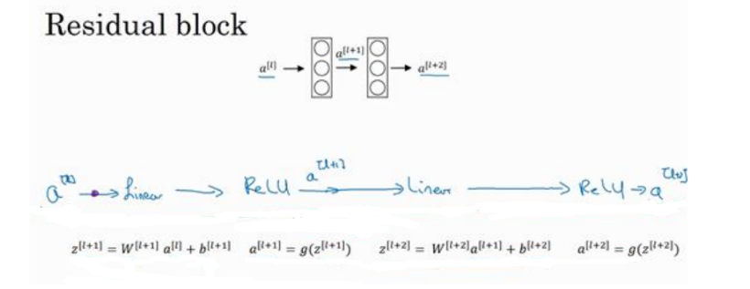
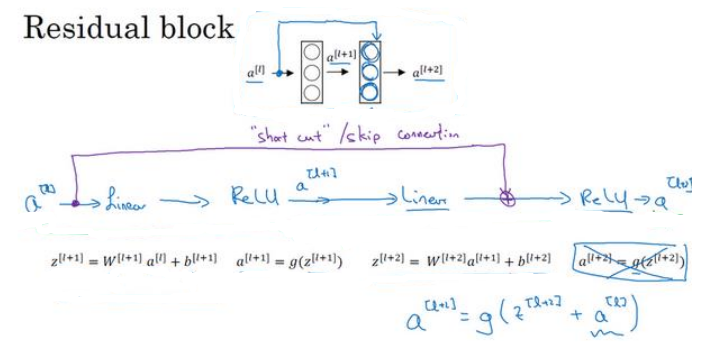

​        随着神经网络的深度增加，在训练过程中存在梯度消失和梯度爆炸问题，训练难度增大。残差神经网络模型是：通过跳跃链接，可以从某一层网络层获取激活,然后迅速反馈给另外一层,甚至是神经网络的更深层。

​        残差神经网络模型是由残差块构建成的，首先了解一下什么是残差块：

​        如上图所示：这是一个两层神经网络,在L层进行线性计算、Rele激活,得到a [l+1] ,再次进行线性计算、Relu激活之后得到a [l+2]，即信息流从a [l] 到a [l+2] 需要经过以上步骤,这是网络层的主路径。 

​       在残差网络中,我们将a [l] 直接向后,拷贝到神经网络的深层,在 ReLU 激活函数前加上a [l] ,这是一条捷径。a [l] 的信息直接到达神经网络的深层,不再沿着主路径传递,这就意味着最后这个等式(a[l+2] = g(z [l+2] ))去掉了,取而代之的是另一个 ReLU 非线性函数,仍然对z [l+2] 进行 g函数处理,但这次要加上a [l] ,即: a [l+2] = g(z [l+2] + a [l] ),

也就是加上的这个a [l] 产生了一个残差块。

