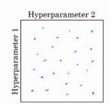
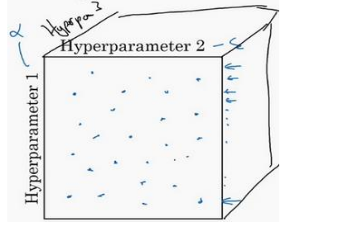
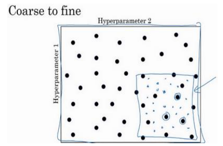
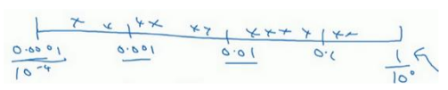

## 超参数的调试

​        在神经网络模型的训练过程中，超参数的处理是最难的事之一。一个完整的神经网络模型超参数包括：学习率a，学习率的衰减率decay-learning-rate，Adam 优化算法的参数：β 1 , β 2 和ε，神经网络层数 l , 不同层中隐藏单元的数量nx (x = 1, 2, 3……)，mini-batch 的大小。在训练过程中调试顺序(按重要性排序)如下：

- 学习速率a是需要调试的最重要的超参数，优先调试；
- 其次是mini-batch，不同层中隐藏单元的数量nx ；
- 接着是层数 l ，学习率衰减decay-learning-rate；
- 最后是一些可以设置默认值的超参数：β1 = 0.9，β2 = 0.999，ε = 10^−8 ，可选择性进行调试。

如何选择调试值呢？

假设两个超参数,称之为超参 1,超参 2,常见的做法是在网格中随机取样点，接着,用这些随机取的点试验超参数的效果，如下图所示：

假设三个超参数,称之为超参 1,超参 2, 超参 3,常 见的做法是在立方体随机取样点，接着,用这些随机取的点试验超参数的效果，如下图所示：

给超参数取值时,另一个技巧是采用由粗糙到精细的策略，比如在二维的那个例子中,你进行了取值,会发现效果最好的某个点,也许这个点周围的其他一些点效果也很好,那在接下来要做的是放大这块小区域(小蓝色方框内),然后在其中更密集得取值或随机取值,聚集更多的资源,不断缩小蓝色方框，不断测试。

## 为超参数选择合适的范围

上述在方框或立方体中随机取值并不是均匀取值，而是选择合适的标尺。

- 如果要选取神经网络的层数 l ,假设选择层数为 2 到 4 中的某个值,接着顺着 2,3,4 随机均匀取样才比较合理。

- 如果你在搜索大小介于0.0001~1之间的学习率a，则不能随机均匀取值，因为如果你画一条从 0.0001 到 1 的数轴,沿其随机均匀取值,那 90%的数值将会落在0.1 到 1 之间，此时使用对数标尺搜索超参数的方式会更合理，分别依次取0.0001,0.001,0.01,0.1,1在数轴上标出：

​        数轴两端分别为10^a 和10^b 之间取值,在此例中,10^a = 0.0001，可计算出a = -4；10^ b = 1，可算出b = 0。可以在[a, b]区间随机均匀地给r取值,这个例子中r ∈ [−4,0]，基于随机取样的超参数a = 10 ^ r 。

- 如果给β 取值,用于计算指数的加权平均值，β是 0.9到 0.999 之间的某个值，最好的方法就是：我们会给1 − β取值,大概是从 0.1 到 0.001，此时，a = -3，b = -1，在区间[−3, −1]里随机均匀的给 r 取值。即:1 −β = 10^r ,

  所以：β = 1 − 10^r。

