## 动量(momentum)梯度下降

### 1.动量梯度下降的背景—指数加权平均数

指数加权平均是一种近似求平均数的方法，计算方法如下：

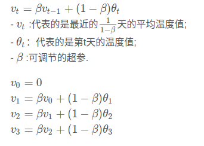

举个例子，下图是某城市一年的温度分布图：

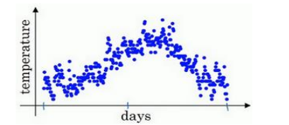

- 取 β = 0.9，通过上述公式可以计算出近10天的平均温度值，对应下图中的红线. 
- 我们取 β = 0.98，通过上述公式可以计算出近50天的平均温度值，对应下图中的绿线. 

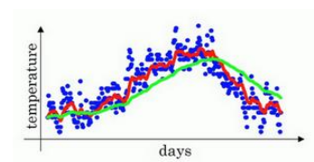

指数加权平均如何计算出每日温度的平均值？

当 β = 0.9，t从 0 到 1 到 2 到 3，t的值在不断增加,第100天的指数加权平均计算方法如下：

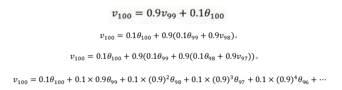

然后我们构建一个指数衰减函数,从 0.1 开始,到0.1 × 0.9,到0.1 × (0.9)^ 2 ,以此类推,所以就有了这个指数衰减函数：

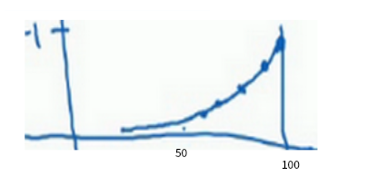

以1/e为一个分界点,衰减到这个值就可以忽略不计，本例中(0.9) ^10 大约为 0.35,这大约是1/e，即10 天后,曲线的高度下降到  1/e，所以 β = 0.9，通过上述公式可以计算出近10天的平均温度值。

### 2. 动量梯度下降法

该算法的基本思想是计算梯度的指数加权平均数,并利用该指数加权平均数更新你的权重。

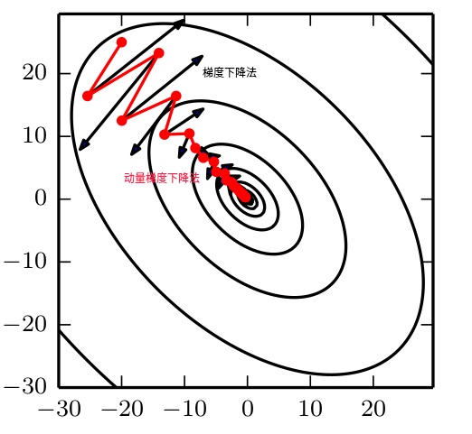

- 上图的黑色是直接进行梯度下降法轨迹，上下波动的幅度减慢了梯度下降法的速度,如果用较大的学习率结果可能会偏离函数的范围,只能使用较小的学习率。
- 如上图的红色是动量梯度下降法轨迹，计算出黑色梯度的指数加权平均数，按照此梯度下降，算法走了一
  条更加直接的路径,在抵达最小值的路上减少了摆动。

具体计算方法如下：

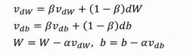

其中：a是学习率，参数Sβ控制着指数加权平均数。

## RMSprop梯度下降

RMSprop 的算法也可以加速梯度下降，我们通过以下的例子来说明这个算法。

假设纵轴代表参数b,横轴代表参数W,我们要做的是减缓b方向的学习,即纵轴方向,同时加快,至少不是减缓横轴方向的学习。

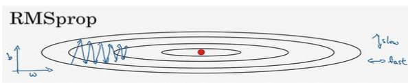

更新公式如下：

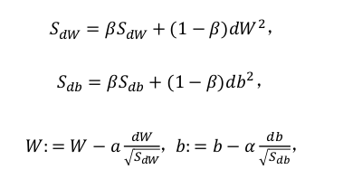

根据图像可以看出垂直方向的梯度要比水平方向梯度的大得多，所以斜率在b方向特别大，所以这些微分中,db较大,dW较小，所以S dW 会相对较小,而S db 又较大；更新时，W要减去一个较大的值，b会减去一个较大的值，所以W方向的变化速率大于b方向的速率，消除了垂直方向的摆动，如下图的绿色轨迹所示：

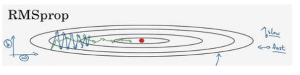

注：一直把纵轴和横轴方向分别称为b和W,只是为了方便展示而已。

## Adam 优化算法

有了上述两个算法的基础，Adam 优化算法就变得容易理解，该算法基本上就是将 Momentum 和 RMSprop 结合在一起。具体计算过程如下：

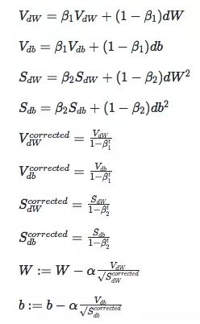

注：corrected表示对计算结果进行偏差修正，β 1的默认值为0.9，β 2推荐使用0.999。

