神经网络模型如何避免过拟合？

## 1.什么是偏差，方差

假设数据集如下：

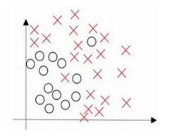

​      如果对这个数据集进行分类，会出现以下三种情况：

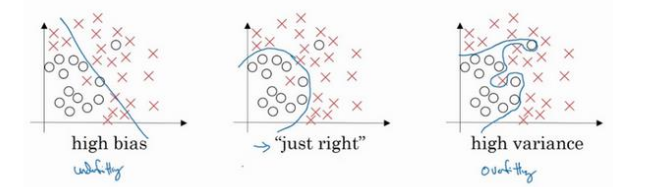

(1)  线性逻辑回归拟合,它并不能很好地拟合该数据,这是高偏差(high bias)的情况,也称为“欠拟合” ( underfitting)。

(2) 非常复杂的分类器拟合,与数据集高度吻合，非常适用于当前这个数据集,对于其他的测试机，分类效果会很差，

​      这是方差较高(high variance),数据过度拟合(overfitting)。

(3) 在两者之间,存在复杂程度适中,数据拟合适度的分类器,称之为“适度拟合”(just right)，是介于过度拟合和欠拟合中间的一类。

比如：

​       假定训练集误差是 1%, 假定验证集误差是 11%,可以看出训练集设置得非常好,而验证集设置相对较差,可能是分类器过度拟合了训练集,这种情况,我们称之为“高方差”。

​        假设训练集误差是 15%,验证集误差是 16%,就是数据欠拟合,就可以说这种算法偏差比较高。

​       在训练神经网络,初始模型训练完成后,我首先要知道算法的偏差高不高。如果偏差很高,甚至无法拟合训练集,那么我们就必须重新设计神经网络模型，比如增加更多隐藏层或者隐藏单元,也可改进、优化算法。

​       如果偏差降低到可以接受的数值,检查一下方差有没有问题,为了评估方差,我们要查看验证集性能,如果验证集误差过大，即方差高,最好的解决办法就是采用更多数据，如果无法获得更多数据,我们也可以尝试通过正则化来减少过拟合。

## 2. L2正则化

深度学习可能存在过拟合问题——高方差,有两个解决方法,一个是正则化,另一个是准备更多的数据。下面我们具体介绍什么是正则化。L2正则化是最常见的正则化类型。L2正则化通过减小参数矩阵W，来达到减弱某些神经元的作用，从而消除的过拟合。

矩阵W的L2范数的定义为：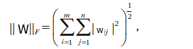

即：矩阵中所有元素的平方求和。

将神经网络模型的损失函数加上λ/2m乘以W范数的平方，即为L2正则化，损失函数变成如下形式：

其中m 为样本数，λ为正则化参数。

为什么只正则化参数w?为什么不再加上参数 b 呢? 因为w通常是一个高维参数矢量,已经可以表达高偏差问题, w可能包含有很多参数,我们不可能拟合所有参数,而b只是单个数字,所以w几乎涵盖所有参数,而不是b,如果加了参数b,影响不大, 因为b只是众多参数中的一个,可以省略不计也可加上后，损失函数变成如下形式：

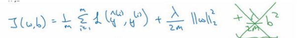

如何使用该范数实现梯度下降呢?

用 backprop 计算出dW的值, backprop 会给出J对W的偏导数,公式如下：

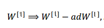

既然已经增加了这个正则项,现在我们要做的就是给dW加上这一项 ,然后计算这个更新项,使用新定义的dW [l] ,它的定义含有相关参数代价函数导数和,以及最后添加的额外正则项,这也是L2正则化有时被称为“权重衰减”的原因。具体公式如下：

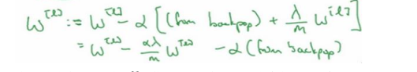

为什么正则化有利于预防过拟合呢? 为什么它可以减少方差问题?

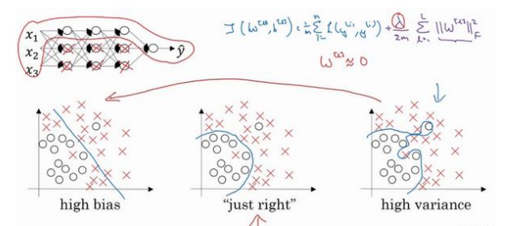

​       如果正则化λ设置得足够大,权重矩阵W被设置为接近于 0 的值,直观理解就是把多隐藏单元的权重设为 0, W会接近于0，但是并不等于0，实际上是该神经网络的所有隐藏单元依然存在,但是它们的影响变得更小了，基本上消除了这些隐藏单元的许多影响。如果是这种情况,这个被大大简化了的神经网络会变成一个很小的网络,小到如同一个逻辑回归单元,可是深度却很大,它会使这个网络从过度拟合（方差较大）的状态更接近左图的高偏差状态。

以下是一个具体的例子：

假设神经网络模型的激活函数是个g(z) = tanh(z)；如果W很小,Z = WX + b 也会很小(在一定的范围内)。g(z)会限制在下图的红色区域，大致呈线性,如果每层几乎都是线性的,那么整个神经网络模型就和和线性回归函数一样。

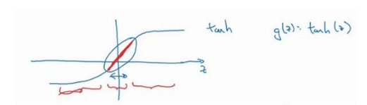

## 3. dropout 正则化

​           除了L2正则化,还有一个非常实用的正则化方法——“Dropout(随机失活)”，以下是他的工作原理：

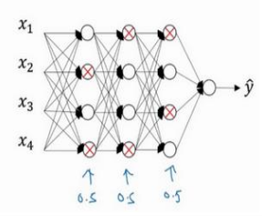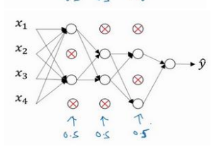

​        若左图所示的神经网络模型存在过拟合的现象，通过dropout 遍历网络的每一层,并设置消除神经网络中节点的概率，从而消除一些节点，得到规模更小的网络。

​        实施 dropout 的最常用的方法是：inverted dropout(反向随机失活)，以下是一个具体例子：

（1）要定义向量d, d [3] 表示一个第三层的 dropout 向量它不能依靠任何特，设置保留某个隐藏单元的概率keep-prob = 0.8，意味着消除任意一个隐藏单元的概率是 0.2，通过keep-prop生成随机矩阵;

 **d3 = np.random.rand(a3.shape[0],a3.shape[1])** **< keep-prop**

从第三层中获取激活函数a [3]，对其重新计算：

**a3 =np.multiply(a3,d3) ,**

乘法运算最终让d [3] 中 0 元素与a [3] 中相对元素归零，

（2） 向外扩展a [3] ,用它除以 keep-prob 参数。

因为，第三层上的神经元数量减少了1 - keep_prop;当我们计算Z4时：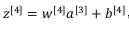为了不影响它的期望值，需要用w [4] a [3] /0.8,它将会修正或弥补我们所需的那部分。

为什么 dropout 会起作用呢?

神经元的输入不要依赖于任何一个特征,因为该单元的输入可能随时被清除，通过传播所有权重, dropout将产生收缩权重的平方范数的效果,和之前讲的L2正则化类似;实施 dropout 的结果会压缩权重,并完成一些预防过拟合的外层正则化;

要注意对于一个多层神经网络：

- 每个层的 keep-prob参数可以不同，可以把某些层的 keep-prob值设置得比其它层更低。
- 也可以在一些层上应用 dropout，而有些层不用 dropout，应用 dropout 的层只含有一个超级参数，就是 keep-prob。
- 在输入层的时候，我们通常是不使用dropout正则化的。
- 做测试的时候，我们是不使用dropout的，只有在训练65的时候才会使用dropout。

## 4. 其他的正则化方法

(1) 数据扩增

比如训练集是一些图片，我们可以对图片进行旋转，变形，随意裁剪来增加数据集。

(2) early stopping

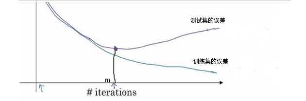

early stopping 代表提早停止训练神经网络,在绘制训练集误差时，同时绘制测试集的误差，测试集误差通常会先呈下降趋势,然后在某个节点处开始上升,early stopping 的作用是,你能看出神经网络在哪个训练阶段的参数的表现效果最好，及时停止训练，可以避免一味追求训练集误差下降而导致的过拟合。

