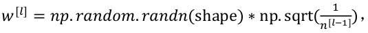

​        训练神经网络,尤其是深度神经所面临的一个问题就是梯度消失或梯度爆炸,也就是导数或坡度有时会变得非常大,加大了训练难度。

## 1. 什么是梯度消失/梯度爆炸

假设神经网络有参数W [1] ,W [2] ,W [3] ...,直到W [l] ,为了简单起见,假设使用线性激活函数g(z) = z,且忽略b,假设b [l] =0,则输出为:

假设每个初始权重矩阵为：

从技术上来讲,最后一项有不同维度，所以输出可以化简为：

它呈指数级增长的,增长的比率是1.5 ^L , 随着L的增加，y将爆炸式增长。

反之，假设每个初始权重矩阵为：

所以输出可以化简为：

激活函数的值将以指数级下降,它是与网络层数数量L相关的函数,L大到一定程度，梯度将会消失。

通过上面的分析可知，权重矩阵的初始值至关重要。

## 2. 神经网络的权重初始化

在神经网络中，Z计算公式如下（暂时忽略b）：

为了使Z的值不过大或者过小，若n越大，则应该控制w i 越小。不同的激活函数，对应着不同的权重初始化的方式。

若激活函数为tanh，可以通过以下公式来设置W的初始值：

若激活函数为relu，可以通过以下公式来设置W的初始值：

注：shape为权重的维度；n^ [l−1]第l层神经单元的数量(即第l − 1层神经元数量)。

一个好的权重矩阵既不会增长过快,也不会太快下降到 0,从而训练出一个权重或梯度不会增长或消失过快的深度网络。我们在训练深度网络时,这也是一个加快训练速度的技巧。

